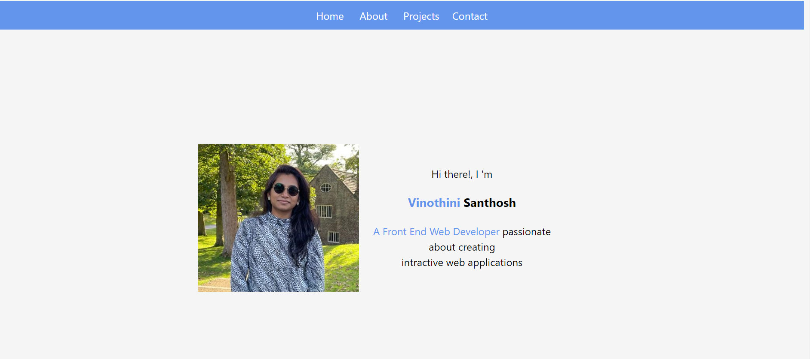
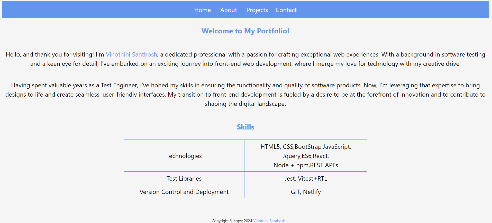
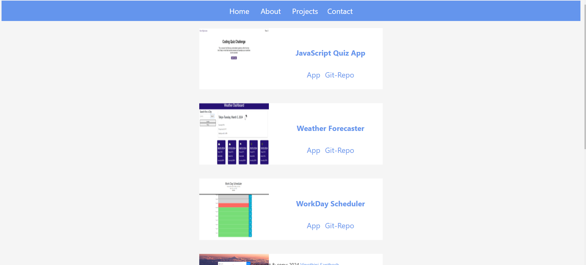
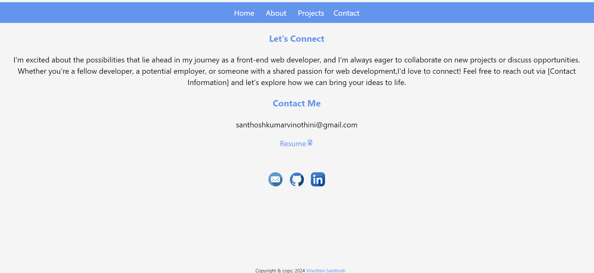

# React-Portfolio

## Description:
   React-Portfolio show case my skills, projects i have built and about me, the application is mobile responsive. The portfolio is built using React and React-Router used for navigation.The portfolio has the following details ,
    * [ ]  Name
    * [ ] Links to my:
    * [ ] GitHub Profile
    * [ ] LinkedIn Page
    * [ ] Email Address
    * [ ] PDF version of my resume
    * [ ] A list of projects (Challenges or Projects). Each project with:
      * [ ] Project title
      * [ ] Link to the deployed version
      * [ ] Link to the GitHub repository
      * [ ] GIF or screenshot of the deployed application.

  ## Portfolio Screenshot:
### Home Page:
   
### About Page:
     
### Project Page:
  
 ### Contact Page:
  
  

* In the above screenshots describes, when the user clicks on skill user gets navigated to skill page, respectively to project->project page and contact->contact page.
 All the pages are rendered dynamically.
* When the user in project page clicks on the App it navigates to respective deployed application and to the respective repository.
* When the user clicks on the Resume icon, Resume in PDF version gets downloaded.
* when the user clicks on git icon,email icon,linkedin icon user gets navigated respectfully. 

## Deployed Portfolio Url:

   https://vinosk.netlify.app/

## Git Repo Url:
   https://github.com/VinoSandy/React-Portfolio.git

## Reference used:
   
  https://vitejs.dev/guide/
  https://www.w3schools.com/react/react_router.asp
  https://stackoverflow.com/questions/6794255/html-download-a-pdf-file-instead-of-opening-them-in-browser-when-clicked
  https://react.dev/learn
  

 